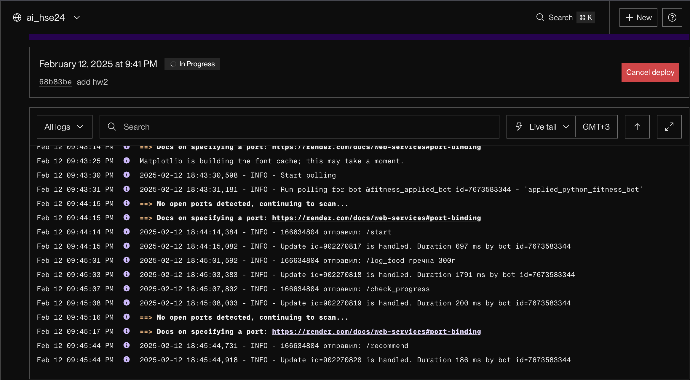

# Telegram-бот для отслеживания питания и тренировок
## Структура проекта

```text
/bot
│── main.py               # Главный файл запуска бота
│── config.py             # Конфигурация (токены API, БД)
│── db.py                 # Подключение к базе данных
│── start.sh              # Скрипт запуска на сервере (Render)
│── requirements.txt      # Список зависимостей
│── /handlers             # Обработчики команд бота
│   ├── start.py          # Обработчик команды /start
│   ├── profile.py        # Заполнение профиля /set_profile
│   ├── food.py           # Логирование еды /log_food
│   ├── water.py          # Логирование воды /log_water
│   ├── exercise.py       # Логирование тренировок /log_workout
│   ├── progress.py       # Отчет о прогрессе /check_progress
│   ├── stats.py          # Графики потребления воды и калорий за последнюю неделю
│   ├── recommend.py      # Рекомендации по питанию и тренировкам
│── /services             # Взаимодействие с API
│   ├── weather.py        # Запрос температуры в городе
│   ├── nutrition.py      # Подключение к API калорийности еды
│   ├── translate.py      # Перевод текста (для API)
│── /middlewares          # Middleware (логирование)
│   ├── logging.py        # Логирование всех сообщений
│── /models               # Модели базы данных (SQLAlchemy)
│   ├── user.py           # Модель пользователя
│   ├── food_log.py       # Модель логов питания
│   ├── water_log.py      # Модель логов воды
│   ├── exercise_log.py   # Модель логов тренировок
│── README.md             # Документация проекта
```
## Функции бота

**Заполнение профиля** (`/set_profile`)  
- Запрашивает возраст, вес, рост, пол, уровень активности и цель  
- Рассчитывает суточную норму калорий и воды  
- Корректирует норму воды в зависимости от температуры в городе  

**Отслеживание питания** (`/log_food`)  
- Ввод продуктов и блюд на русском языке  
- перевод на английский через google api и анализ калорийности через API 

**Отслеживание воды** (`/log_water`)  
- Фиксация количества выпитой воды  
- Перерасчет оставшейся нормы  

**Фиксация тренировок** (`/log_workout`)  
- Учет типов тренировок и их длительности  
- Расчет сожженных калорий  
- Коррекция водного баланса после тренировки  
- Отправка мотивационных стикеров за тренировки  

**Статистика и прогресс** (`/check_progress`)
- Отчет за день с оставшейся нормой  
- Отчет за неделю в виде графиков  

**Статистика** (`/stats`)  
- Графики потребления воды и калорий за последнюю неделю

**Рекомендации** (`/recommend`)  
- Подбор продуктов с низким содержанием калорий  
- Выбор тренировок для достижения цели  
------
## Демонстрация работы
[Демонстрация](https://youtu.be/EwsMY4XV8hs)

## Скрины деплоя на render.com
