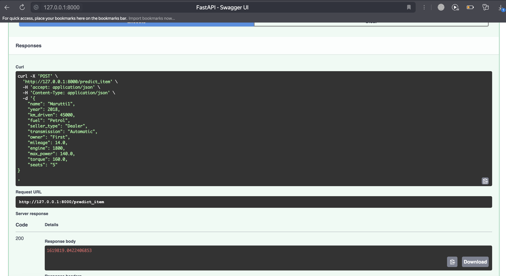
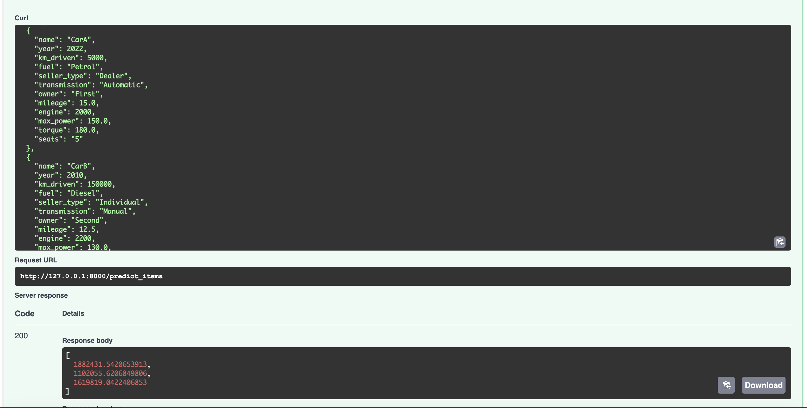
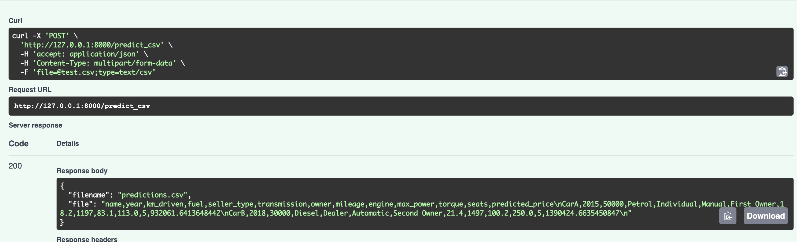

# Что было сделано

## EDA

### Предобработка
1. Удалили дубликаты
2. Извлекли из текстовых столбцов `mileage`, `engine`, `max_power` числовые признаки
3. Заполнили пропуски в числовых столбцах при помощи медианы, закодировали категориальные признаки методом one-hot кодирования

### Визуализация
1. Рассмотрели попарные распределения признаков на тренировочных и тестовых данных
2. С помощью тепловой карты корреляций выявили, что наиболее сильная положительная корреляция наблюдается между максимальной мощностью (max_power) и мощностью двигателя engine (0.68)
3. Матрица корреляций по всем признакам (phik) показала, что между целевой переменной (selling_price) и категориальными признаками (owner, transmission и seller_type) наблюдается умеренная корреляция
4. Есть тяжелые хвосты в распределении таргета как в трейне, так и в тесте. Их можно убрать логарифмированием.
### Основные выводы - Обучение моделей и расчёт метрик

## Обучение моделей

1. Обучили линейную регрессию без и со стандартизацией признаков
- Стандартизация не изменила результат
- Наибольший вклад в модель, исходя из весов, дает признак `max_power`
2. Обучили линейные регрессии с регуляризацией: `Lasso` и `ElasticNet`
- Гиперпараметры подбирали на кросс-валидации с 10-ю фолдами
- Улучшить качество модели не удалось, но удалось его сохранить при уменьшении размерности признакового пространства ($L_1$-регуляризация занулила веса при признаках `mileage`, `engine` и `seats` когда в качесте scoring метрики использовали $R^2$)
3. Добавили в модель категориальные признаки и обучили `Ridge` регрессию
- Из названия авто выделили марку и закодировали при помощи `OHE` ее и переменную `seats` 
- Это помогло улучшить качество модели по метрике `R^2`
4. Сравнили обученные модели по кастомной метрике: доля прогнозов модели, отличающихся от истинного значения не более чем на 10%
- Все модели показали практически одинаковое качество в рамках этой метрики
5. Реализовали FASTApi с тремя ручками

### Демонстрация работы
- Реализованы 3 ручки для получения предсказаний 
1. `/predict_item`: получение предсказания по одному объекту

2. `/predict_items`: получение предсказаний для списка объектов

3. `/predict_items_csv`: получение предсказаний по объектам из csv
